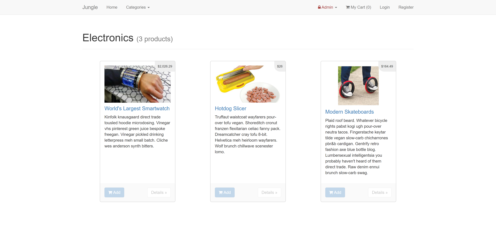

# Jungle

A mini e-commerce application built with Rails 4.2 for purposes of teaching Rails by example.

## Setup

1. Run `bundle install` to install dependencies
2. Create `config/database.yml` by copying `config/database.example.yml`
3. Create `config/secrets.yml` by copying `config/secrets.example.yml`
4. Run `bin/rake db:reset` to create, load and seed db
5. Create .env file based on .env.example
6. Sign up for a Stripe account
7. Put Stripe (test) keys into appropriate .env vars
8. Run `bin/rails s -b 0.0.0.0` to start the server

## Stripe Testing

Use Credit Card # 4111 1111 1111 1111 for testing success scenarios.

More information in their docs: <https://stripe.com/docs/testing#cards>

## Dependencies

* Rails 4.2 [Rails Guide](http://guides.rubyonrails.org/v4.2/)
* PostgreSQL 9.x
* Stripe
* bcrypt 3.1.7

## features 
* ### User Accounts
  * An unregistered user can register.
  * A user can register or login from any page, if not already.logged in.
  * A user can logout at anytime from anypage.
  * Passwords are double-checked and encypted.
* ### Products
  * You can add add any product to cart.
  * If a product is out of stock, it will display Sold-out badge.
  * Products can be filtered by categories.
* ### Cart
  * A user can see their cart with their added products displayed.
  * If the cart is empty, a message will indicate so and a link back to products.
* ### Admins
  * Admins have seperate views for products & categories.
  * They add or remove products, and can add categories.

## Screenshots

### Regular Users
#### Homepage & Product page for a regular user

#### Product Page by Category

#### Product item page

#### Cart page (empty)

#### Cart page (with items)

#### Register Page

#### Login Page

---
### Admins: 
#### Products Page for an admin

#### Adding a new Product

#### Categories Page for an admin

#### Adding a New category
